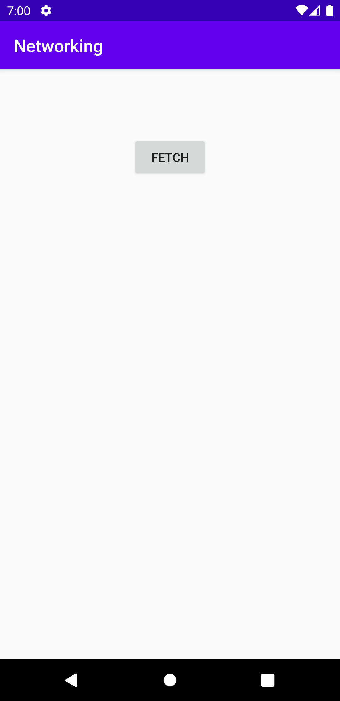
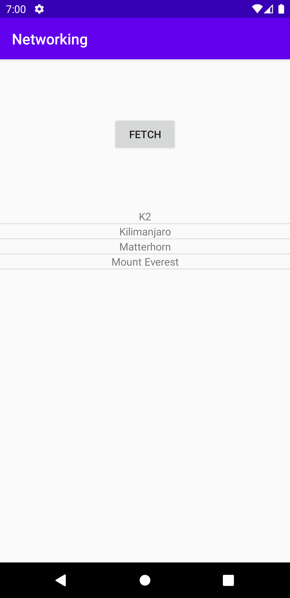
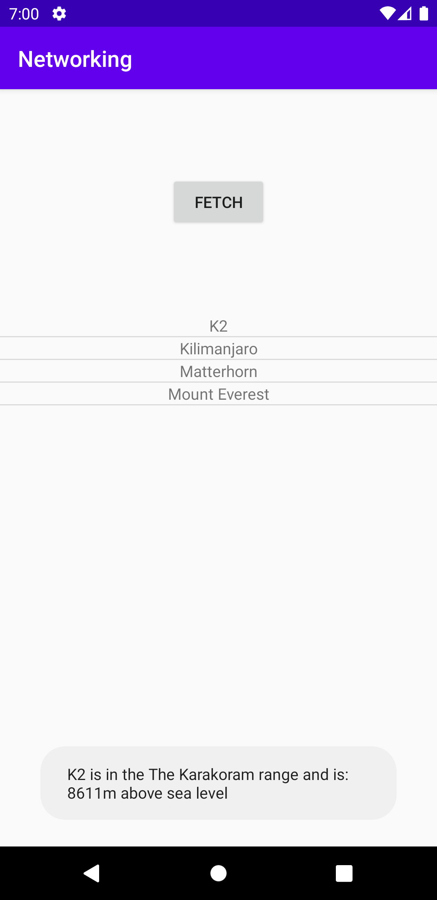

# Rapport
Först skapades en ListView widget med med id:et my_listview.
```XML
    <ListView
        android:id="@+id/my_listview"
        android:layout_width="match_parent"
        android:layout_height="400dp"
        app:layout_constraintBottom_toBottomOf="parent"
        app:layout_constraintEnd_toEndOf="parent"
        app:layout_constraintEnd_toStartOf="parent"
        app:layout_constraintLeft_toLeftOf="parent"
        app:layout_constraintRight_toRightOf="parent"
        app:layout_constraintTop_toBottomOf="@+id/fetch_json" />
```
sedan skapades en ny wml fil i layout innehållandes en textview med id:et list_item.
```XML
<TextView
    xmlns:android="http://schemas.android.com/apk/res/android"
    android:id="@+id/list_item"
    android:layout_width="match_parent"
    android:layout_height="match_parent"
    android:textAlignment="center"
    android:gravity="center_horizontal">

</TextView>
```
efter det skapades en klass för berg kallad Mountain i en egen java fil med två string variabler, en int variabel, en par constructors för att skapa berg ,den ena för om det inte kommer med någon information och den andra med information medskickat, en String som används för att sortera information och sist en override på tostring funktionen som istället ger namnet på berget.
```JAVA
public class Mountain {
    private String name;
    private String location;
    private int height;
    //default
    public Mountain()
    {
        name = "Missing name";
        location = "Missing Location";
        height = -1;
    }
    //new mountains
    public Mountain(String n, String l, int h) {
        name = n;
        location = l;
        height = h;
    }
    public String info(){
        String txt = new String();
        txt += name+" is in "+location+" and is: "+height+"m above sea level";
        return txt;
    }
    @Override
    public String toString(){
        return name;
    }
}
```
sedan skapades en arraylist av Mountain class objekt kallad mountainArrayList och gavs en ny arraylist. en ArrayAdapter för Mountain class objekt deklareras globalt.
```JAVA
    private ArrayList<Mountain> mountainArrayList = new ArrayList<>();
    private ArrayAdapter<Mountain> mountainArrayAdapter;
```
efter det i oncreate gavs mountainArrayAdapter en ny adapter av typen Mountain som kopplade xml filen, textview elementet och listan. en listview med namn myListView kopplas till listview elementet skapat i xml-filen med hjälp av dess id. adaptern kopplas till listview med set adapter.
```JAVA
        mountainArrayAdapter = new ArrayAdapter<Mountain>(this, R.layout.list_item, R.id.list_item, mountainArrayList);
        ListView myListView = findViewById(R.id.my_listview);
        myListView.setAdapter(mountainArrayAdapter);

```
sen skapades en klass för att hämta data från en hemsida som omvandlar datan till en textsträng.
```JAVA
@SuppressLint("StaticFieldLeak")
    private class JsonTask extends AsyncTask<String, String, String> {

        private HttpURLConnection connection = null;
        private BufferedReader reader = null;

        protected String doInBackground(String... params) {
            try {
                URL url = new URL(params[0]);
                connection = (HttpURLConnection) url.openConnection();
                connection.connect();

                InputStream stream = connection.getInputStream();
                reader = new BufferedReader(new InputStreamReader(stream));

                StringBuilder builder = new StringBuilder();
                String line;
                while ((line = reader.readLine()) != null && !isCancelled()) {
                    builder.append(line).append("\n");
                }
                return builder.toString();
            }
            catch (MalformedURLException e) {
                e.printStackTrace();
            }
            catch (IOException e) {
                e.printStackTrace();
            }
            finally {
                if (connection != null) {
                    connection.disconnect();
                }
                try {
                    if (reader != null) {
                        reader.close();
                    }
                }
                catch (IOException e) {
                    e.printStackTrace();
                }
            }
            return null;
        }
```
i botten av klassen finns en onpostexecute vari programmet med hjälp av en try catch i try delen först rensar listan sedan skapar en ny array utifrån textsträngen.
Efter det med hjälp av en for loop som skapar json objekt för array cellen den som har samma nummer som loop omgången, hämtar en sträng som döps till namn från elementet som heter namn, liknande för location, hämtar värdet av size och lagrar det i en int som heter height, lägger dessa variabler i en ny variabel av typen Mountain kallad mountain och lägger till mountain i listan.
sen skickas en updatering till adapter med hjälp av notifyDataSetChanged() och i catch som försöker fånga JSONexception skrivs ett felmeddelande till logcat för att hitta felet med hjälp av log.
```JAVA
        @Override
        protected void onPostExecute(String json) {
            try {
                mountainArrayList.clear();
                JSONArray jsonArray = new JSONArray(json);
                for (int i=0;i<jsonArray.length();i++){
                    JSONObject jsonObject = jsonArray.getJSONObject(i);
                    String name = jsonObject.getString("name");
                    String location = jsonObject.getString("location");
                    int height = jsonObject.getInt("size");
                    Mountain mountain = new Mountain(name, location, height);
                    mountainArrayList.add(mountain);
                }
                mountainArrayAdapter.notifyDataSetChanged();
            }
            catch (JSONException e){
                Log.d("TAG", json+" didn't work because of E:"+e);
            }
        }
    }
```
sedan skapades ett Button element i huvud layoutfilen och i java koden i onCreate används den som variabeln fetch och det skapas en OnClickListener för knappen, som execute klassen som hämtar datan med en länk till sidan datan kommer från.
```XML
    <Button
        android:id="@+id/fetch_json"
        android:layout_width="wrap_content"
        android:layout_height="wrap_content"
        android:text="@string/fetch"
        app:layout_constraintBottom_toTopOf="@+id/my_listview"
        app:layout_constraintLeft_toLeftOf="parent"
        app:layout_constraintRight_toRightOf="parent"
        app:layout_constraintTop_toTopOf="parent"/>
```
```JAVA
        Button fetch = findViewById(R.id.fetch_json);
        fetch.setOnClickListener(new View.OnClickListener() {
            @Override
            public void onClick(View view) {
                new JsonTask().execute("https://wwwlab.iit.his.se/brom/kurser/mobilprog/dbservice/admin/getdataasjson.php?type=brom");
            }
        });
```
sist skapdes en OnItemClickListener för listview elementet som skriver ut en toast som använder sig av info funktionen för att skriva ut texten för den list medlem som klickas på.
```JAVA
        myListView.setOnItemClickListener(new AdapterView.OnItemClickListener() {
            @Override
            public void onItemClick(AdapterView<?> parent, View view, int position, long id) {
                Toast.makeText(getApplicationContext(), mountainArrayList.get(position).info(), Toast.LENGTH_LONG).show();
            }
        });
```

screenshot innan fetch

screenshot efter fetch

screenshot efter klick

